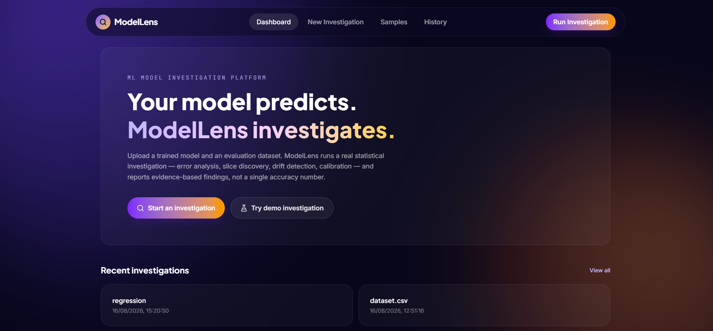
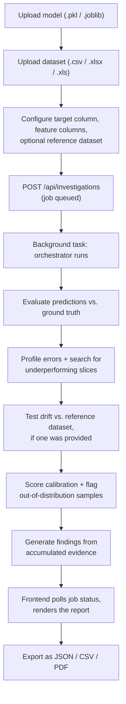
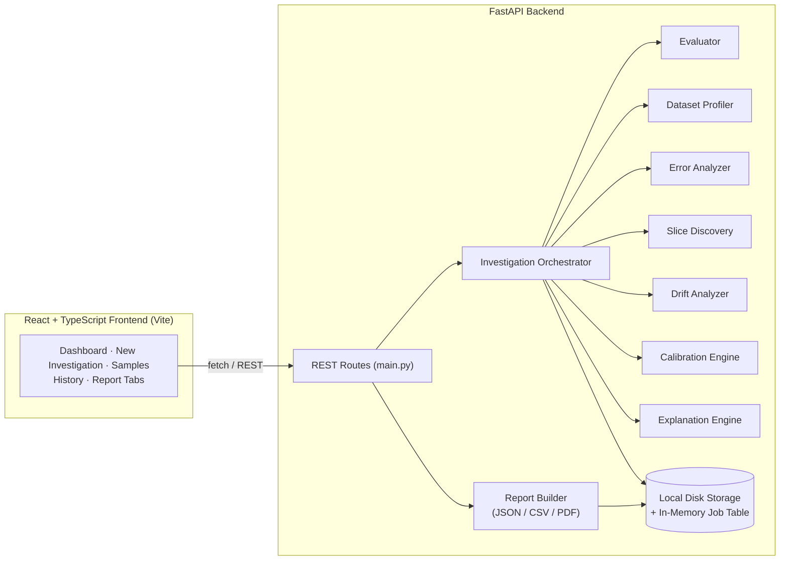
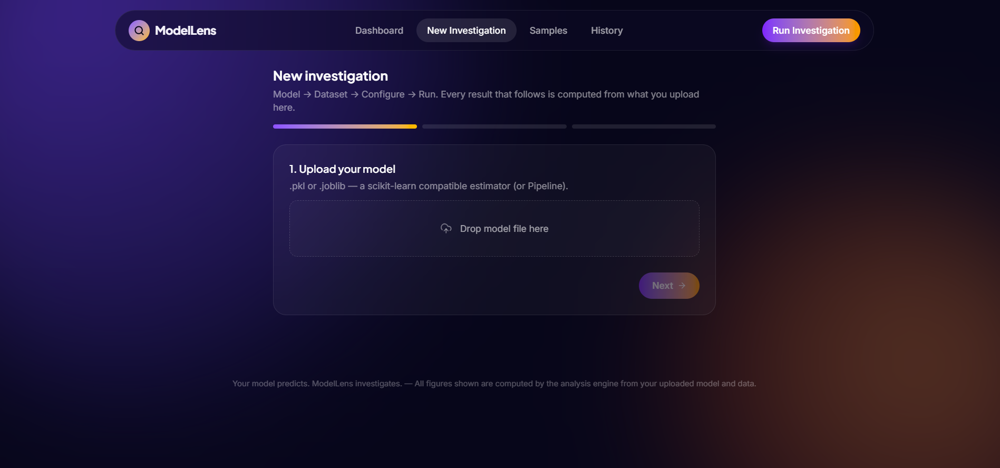
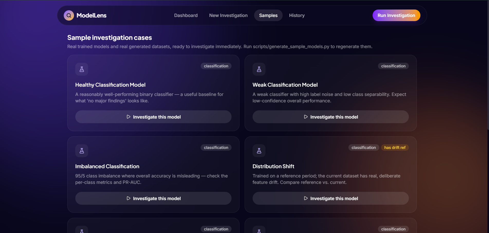
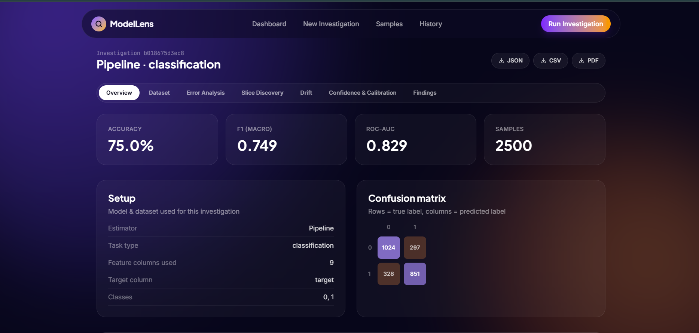
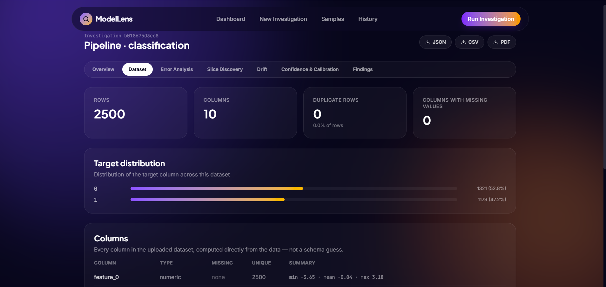
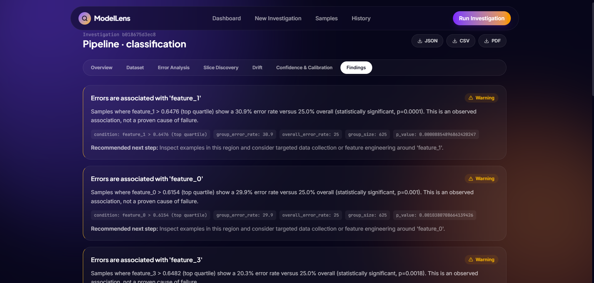
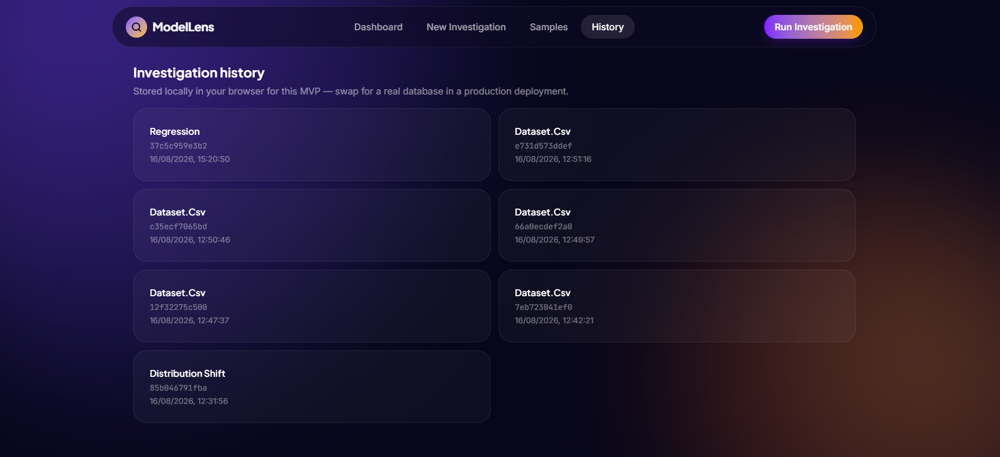

# ModelLens

Upload a trained scikit-learn model and an evaluation dataset. ModelLens runs a real statistical investigation — evaluation, error analysis, subgroup discovery, drift testing, and calibration — and reports the findings as structured, evidence-backed statements instead of a single accuracy score.


[Live Demo](https://modellens-1.onrender.com) · [API](https://modellens-12i4.onrender.com/api/health) · [Getting Started](#getting-started) · [Limitations](#current-limitations)

> Hosted on Render's free tier — the API may take 30–60s to wake up after a period of inactivity.



## Overview

ModelLens is a full-stack tool for investigating how a trained model actually behaves, rather than trusting a single headline metric. A FastAPI backend loads a user-supplied scikit-learn estimator (or `Pipeline`) and dataset, runs it through evaluation, error, drift, and calibration analysis, and returns a structured report; a React/TypeScript frontend presents that report across dedicated tabs and lets it be exported as JSON, CSV, or PDF.

It's aimed at the point in a modeling workflow right after training, when the question stops being "does it run" and becomes "should I trust it, and where would it fail." Every figure in a report — every metric, confusion-matrix cell, p-value, and drift score — is computed at request time from the uploaded model and data; none of it is precomputed or templated.

## The Problem

A single accuracy number can hide the failure modes that matter most. It's straightforward to observe that a model scores 95% and much harder to find out, without manual work, *which* 5% it gets wrong, *why*, and whether that 5% is evenly spread or concentrated in a subgroup that matters. Manually cross-checking per-class metrics, testing for data drift, checking whether confidence scores are trustworthy, and hunting for underperforming slices is normally a scattered, ad hoc process repeated by hand for every model.

The repository's own included sample makes the point concretely: the imbalanced-classification case scores **95.8% accuracy** but an **F1 of 0.71** and a **PR-AUC of 0.51** — close to random — on the minority class. Accuracy alone would call that model fine.

## The Solution

ModelLens turns that manual process into a single, repeatable pipeline:

```
Model + Dataset (+ optional reference dataset)
                │
                ▼
        Evaluation Orchestrator
                │
   ┌────────────┼──────────────────────────────┐
   ▼            ▼              ▼                ▼
Metrics    Error/Slice     Drift vs.      Calibration &
(Evaluator)  Analysis      Reference       OOD Detection
   │            │              │                │
   └────────────┴──────┬───────┴────────────────┘
                        ▼
              Evidence-Based Findings
                        │
                        ▼
         Investigation Report (JSON / CSV / PDF)
```

Each stage runs against the real uploaded artifacts and contributes evidence — a metric, a statistical test result, a flagged subgroup — that the finding generator turns into a plain-language statement with its supporting numbers attached, not a hardcoded template filled with placeholder text.

## Core Capabilities

| Capability | Description |
|---|---|
| **Evaluation** | Accuracy, precision/recall/F1 (macro & weighted), ROC-AUC, PR-AUC, full confusion matrix for classification; MAE, MSE, RMSE, R², residuals for regression |
| **Dataset profiling** | Row/column counts, dtypes, missing values, duplicate rows, target class balance — read from the uploaded file, not a schema guess |
| **Error analysis** | Per-example error inspection combined with statistically tested error concentration by feature (two-proportion z-test / chi-square) |
| **Slice discovery** | A shallow decision tree trained to predict *error itself* from the features, with leaf rules extracted and tested against the overall error rate — a standard subgroup-discovery technique, not hardcoded conditions |
| **Drift detection** | PSI, Kolmogorov–Smirnov, and Wasserstein distance for numeric features; PSI and frequency comparison for categoricals, against a reference/training dataset |
| **Confidence & calibration** | Reliability curves, Expected Calibration Error (manually binned), and explicit detection of high-confidence (≥0.9 confidence) wrong predictions |
| **Out-of-distribution flagging** | IsolationForest-based anomaly scoring, always reported as *potential*, never asserted as certain |
| **Feature importance** | Native impurity/coefficient importance when the model exposes it, permutation importance (8 repeats) otherwise, with an explicit "unavailable" result when neither applies |
| **Report export** | JSON, CSV, and PDF, generated from the same stored result object |

## How ModelLens Works



1. **Upload** — `POST /api/models/upload` loads the file with `joblib`/`pickle`, rejects anything without a `.predict()` method, and returns the inferred task type, expected feature count, and classes. `POST /api/datasets/upload` parses the file and profiles it immediately.
2. **Configure & run** — `POST /api/investigations` registers a job and hands it to a FastAPI `BackgroundTasks` worker; the request returns immediately with an `investigation_id`.
3. **Pipeline execution** — the orchestrator (`orchestrator.py`) validates model/dataset compatibility, runs predictions, then calls the evaluator, error analyzer, slice discovery, drift analyzer, calibration engine, and explanation engine in sequence, reporting progress after each stage.
4. **Result delivery** — the frontend polls `GET /api/investigations/{id}` until `status == "completed"`, then fetches `/results` and renders it across the Overview, Dataset, Error Analysis, Slice Discovery, Drift, Confidence & Calibration, and Findings tabs.
5. **Export** — `GET /api/investigations/{id}/report?format=` returns the same result serialized as JSON, CSV, or a ReportLab-generated PDF.

## Architecture



- **Frontend** — a React SPA that never computes analysis itself; it uploads files, polls job status, and renders whatever the API returns.
- **API layer** (`backend/app/main.py`) — the only entry point into the system: model/dataset upload, sample-case loading, investigation lifecycle, and report export.
- **Orchestrator** (`ml_engine/orchestrator.py`) — the single place that sequences every analysis stage and assembles one consolidated result dict.
- **Storage** (`app/storage.py`) — local disk for model/dataset files and completed results, plus a `threading.Lock`-guarded in-memory dict for job status. Explicitly documented in the module's own docstring as a single-process design, not production multi-worker storage.

## Technical Implementation

**Frontend.** React 19 + TypeScript on Vite, styled with Tailwind CSS 4, charted with Recharts, routed with React Router. It holds no analysis logic — its job is upload, poll, and render.

**Backend / API.** FastAPI with CORS enabled for all origins. Long-running work (the investigation itself) runs via `BackgroundTasks` rather than blocking the request, with job status tracked separately so the frontend can poll instead of holding a connection open.

**Model adapter layer** (`adapters.py`). Wraps whatever gets unpickled behind one interface so the rest of the engine never special-cases model classes: anything exposing `.predict()` (and optionally `.predict_proba()`) is accepted, which is why XGBoost/LightGBM sklearn wrappers work without extra code. Deep-learning formats (`.h5`, `.keras`, `.pt`, `.pth`, `.onnx`, TensorFlow `SavedModel`) are rejected at upload with a specific error message rather than failing deep inside the pipeline.

**Slice discovery** (`slice_discovery.py`). Trains a shallow `DecisionTreeClassifier` (`max_depth=3`, `min_samples_leaf=30`, `class_weight="balanced"`) to predict *whether a prediction was wrong* from the input features — not to make predictions itself. Each leaf becomes a candidate slice; slices are kept only if their error rate exceeds the overall rate, and are tested with a two-proportion z-test to attach a real p-value rather than reporting the gap alone.

**Drift detection** (`drift.py`). For numeric features: Population Stability Index over quantile-based bins, a Kolmogorov–Smirnov test, and Wasserstein distance. For categoricals: PSI over category frequencies. Severity is thresholded (`PSI < 0.1` → normal, `< 0.25` → drift, otherwise → severe) rather than left as a raw, uninterpreted number.

**Calibration** (`calibration.py`). Expected Calibration Error is computed with a manual 10-bin implementation alongside scikit-learn's `calibration_curve`, and high-confidence errors (confidence ≥ 0.9 but wrong) are counted separately, since a well-calibrated-looking ECE can still hide a small number of dangerously overconfident mistakes.

**Explanation** (`explanation.py`). Feature importance uses the model's native importances when available, falls back to permutation importance (8 repeats) when it isn't, and returns an explicit `available: false` with a reason if neither applies — rather than guessing. Per-example explanations are a labeled heuristic (a feature's deviation from the training mean weighted by its global importance); the code's own docstring is explicit that this is *not* SHAP, and no SHAP computation is claimed anywhere in the system.

**Reports** (`report.py`). JSON and CSV are built directly from the stored result dict; PDF is generated server-side with ReportLab from the same data — export is not a client-side reconstruction.

## Feature Showcase

### Guided investigation workflow
A three-step flow — model upload, dataset upload, then configuration and run — where each later step operates on exactly what was uploaded in the step before it, not on an assumed schema.



### Sample investigation cases
Seven pre-generated model/dataset pairs, ready to investigate immediately: a healthy baseline, a weak/noisy classifier, a 95/5 class imbalance, a distribution-shift case with a real reference dataset, a structurally error-prone model, a text classifier, and a regression case. Regenerable via `scripts/generate_sample_models.py`.



### Evaluation overview
Headline metrics — accuracy, macro F1, ROC-AUC, sample count — next to the exact model/dataset setup used for the run and a full confusion matrix, so the numbers are always traceable back to what produced them.



### Dataset transparency
Row and column counts, duplicate-row detection, missing-value counts, target class distribution, and a per-column type/summary table, computed from the uploaded file rather than inferred.



### Statistically-tested findings
Each finding states its condition, the group error rate against the overall rate, the sample size behind it, and a p-value — paired with an explicit statement that the association is not a proven cause of failure, plus a concrete next step.



### Investigation history
Past runs listed with model type, ID, and timestamp for quick recall.



## Engineering Highlights

- **Subgroup discovery via a real model, not rule templates.** Slice discovery fits an actual `DecisionTreeClassifier` against the error signal and extracts its leaves as candidate slices, then validates each with a z-test — the "findings" are the output of a statistical procedure, not fill-in-the-blank text.
- **Graceful degradation is explicit, not silent.** Feature importance, per-example explanations, and calibration all return a structured `available: false` with a reason when the model or data doesn't support them, instead of returning a fabricated number.
- **Format-agnostic model support without special-casing.** The adapter layer only requires `.predict()` (and optionally `.predict_proba()`), so any scikit-learn-compatible object — including third-party estimators like XGBoost/LightGBM wrappers — works through one code path.
- **Unsupported formats fail loudly and specifically.** Deep-learning checkpoints are caught at upload time with a message naming the exact framework detected, rather than surfacing an opaque stack trace later in the pipeline.
- **Documented storage tradeoff.** `storage.py`'s own docstring states plainly that in-memory job tracking and local-disk files are a single-process design choice, and names exactly what a production swap would require (object storage, a real queue, Postgres) — a limitation stated once in the code and carried through to this README rather than discovered later.

## Project Structure

```
modellens/
├── frontend/                 React + Vite + TypeScript + Tailwind UI
│   ├── src/
│   └── .env.example
├── backend/
│   ├── app/
│   │   ├── main.py                  FastAPI app, all HTTP routes
│   │   ├── storage.py               local-disk file storage + in-memory job tracking
│   │   ├── report.py                JSON / CSV / PDF report builders
│   │   └── ml_engine/
│   │       ├── adapters.py            model loading + compatibility validation
│   │       ├── evaluator.py            classification & regression metrics
│   │       ├── dataset_profile.py      dataset schema / stats / target balance
│   │       ├── error_analysis.py       error tables + explanations
│   │       ├── slice_discovery.py      decision-tree-based subgroup discovery
│   │       ├── drift.py                PSI / KS / Wasserstein / chi-square
│   │       ├── calibration.py          confidence analysis, ECE, reliability
│   │       ├── explanation.py          feature importance + OOD detection
│   │       ├── findings.py             evidence → finding templates
│   │       └── orchestrator.py         runs the full pipeline end to end
│   └── tests/                       pytest unit + integration tests
├── sample_models/             pre-generatable trained model artifacts (.joblib)
├── sample_data/                pre-generatable synthetic datasets (.csv)
├── scripts/                    generate_sample_data.py, generate_sample_models.py
└── docs/screenshots/           README image assets
```

## Tech Stack

**Frontend**
React 19 · TypeScript · Vite · Tailwind CSS 4 · Recharts · React Router

**Backend**
Python · FastAPI · Uvicorn

**ML / Statistics**
scikit-learn · pandas · numpy · scipy

**Reports**
ReportLab (PDF generation)

**Testing**
pytest · httpx

**Deployment**
Render (frontend and API deployed as separate services)

## Getting Started

**Prerequisites:** Python 3.11+, Node 18+

**Environment variables**

| Variable | Where | Purpose |
|---|---|---|
| `VITE_API_URL` | `frontend/.env` | Base URL the frontend calls for the API. `.env.example` ships with a Render URL as a default; for local development point it at `http://localhost:8000`. |

**Installation & running locally**

```bash
git clone https://github.com/MumtazFatima-08/modellens.git
cd modellens

# Generate the sample models & datasets used by the Samples page
python3 scripts/generate_sample_data.py
python3 scripts/generate_sample_models.py
```

Terminal 1 — backend:
```bash
cd backend
python -m venv .venv && source .venv/bin/activate   # Windows: .venv\Scripts\activate
python -m pip install -r requirements.txt
python -m uvicorn app.main:app --reload --port 8000
```

Terminal 2 — frontend:
```bash
cd frontend
npm install
cp .env.example .env
# edit .env: VITE_API_URL=http://localhost:8000
npm run dev
```

## Usage

1. Open the app at the URL Vite prints (or the live demo).
2. Either click **Try demo investigation**, pick a case from **Samples**, or go to **New Investigation** and upload your own `.pkl`/`.joblib` model and `.csv`/`.xlsx`/`.xls` dataset.
3. Set the target column (and, for drift analysis, an optional reference dataset) and run the investigation.
4. Wait for the job to move from `queued` → `running` → `completed` (polled automatically).
5. Review the report across the Overview, Dataset, Error Analysis, Slice Discovery, Drift, Confidence & Calibration, and Findings tabs.
6. Export the result as JSON, CSV, or PDF from the report header if needed.

**Running the test suite:**
```bash
cd backend
PYTHONPATH=. pytest tests/ -v
```
Covers metrics, drift, slice discovery, calibration, dataset profiling, Excel upload, unsupported-format rejection, and full integration tests through the live API, including the text-classification pipeline.

## Current Limitations

- **Correlation, not causation.** Error-concentration and slice findings are observed associations; they don't prove a feature *causes* failure.
- **Drift is not automatically failure.** A drift signal should be cross-checked against performance-degradation and slice findings before acting on it.
- **Feature importance isn't causal**, especially with correlated features.
- **The OOD flag is a statistical anomaly signal**, not proof a sample is malicious, mislabeled, or genuinely outside the model's valid domain.
- **A significant p-value isn't automatically meaningful** — effect size and sample size still need to be checked alongside it.
- **Single-process storage.** Local disk files and an in-memory job dictionary work for local or single-instance use, not multi-worker production; that would need object storage, a real task queue, and Postgres, as noted directly in `storage.py`.
- **No SHAP integration.** Per-example explanations use a labeled importance-weighted heuristic instead, to keep the dependency footprint installable everywhere.
- **No deep-learning or image model support.** `.h5`, `.pt`/`.pth`, `.onnx`, and TensorFlow `SavedModel` uploads are rejected with a specific message; adding real support would need a dedicated adapter, image preprocessing, and different visualizations (image grids, saliency maps) — not a file-extension toggle.
- **Investigation history lives in browser `localStorage`** in this build, not a database, so it won't follow a user across browsers or devices.

## Roadmap

- Real SHAP integration for model families that support it
- Multiple-testing correction (Benjamini–Hochberg) across slice/feature significance tests
- Bootstrapped confidence intervals on reported metrics
- Fairness/bias metrics across a user-designated sensitive attribute
- Model comparison mode — investigate two model versions side-by-side
- Celery/RQ + Postgres + object storage for real multi-user deployment
- Image model (CNN) and transformer-based text model support

## Author

**Mumtaz Fatima**
[GitHub](https://github.com/MumtazFatima-08)

---

*ModelLens reports statistical associations observed in your data. It does not establish causation, does not guarantee real-world significance, and does not certify a model for any particular use case.*
